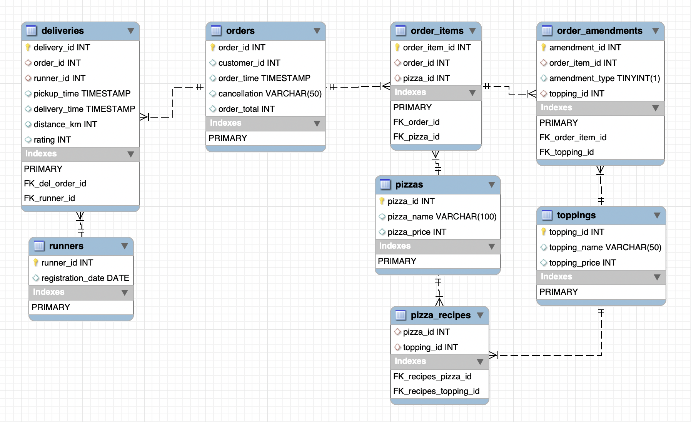

<h1>Case Study 2 : Pizza Runner</h1>

## The schema
I started out with the [given schema](1_schema.sql) (see diagram below) and [cleaned the data](2_data_cleaning.sql). However, once I started working on the case study questions I ran into problems which caused me to [redesign the schema](3_schema_v2.sql). 

For example, in the original `pizza_recipes` table, the topping ids are given as a comma delimited list. This made querying the pizza ingredients difficult, so instead I created a `topping_id` column and stored the pizza recipes as one row per topping instead. 

The original table names were confusing too, so I renamed `customer_orders` to `order_items` and `runner_orders` to `orders`. I created a new `deliveries` table to store the delivery data that had been in the `runner_orders` table before. When it came to adding a rating (see question D3), I simply added a `rating` column to the `deliveries` table. The [EER diagram](pizza_runner_v2.png) shows the final revised schema. 

Of course, in the real world there would also be a customers and delivery addresses table, as well as name and contact details for the runners!

## Case Study Questions

### [A. Pizza Metrics](A_pizza_metrics.md)
### [B. Runner and Customer Experience](B_runner_cust_experience.md)
### [C. Ingredient Optimisation](C_ingredient_optimisation.md)
### [D. Pricing and Ratings](D_pricing_and_ratings.md)
### E. Bonus Question
Having redesigned the pizza runner schema it was a simple matter to add the new Supreme pizza to the `pizzas` table and specify all the toppings in the `pizza_recipes` table.
